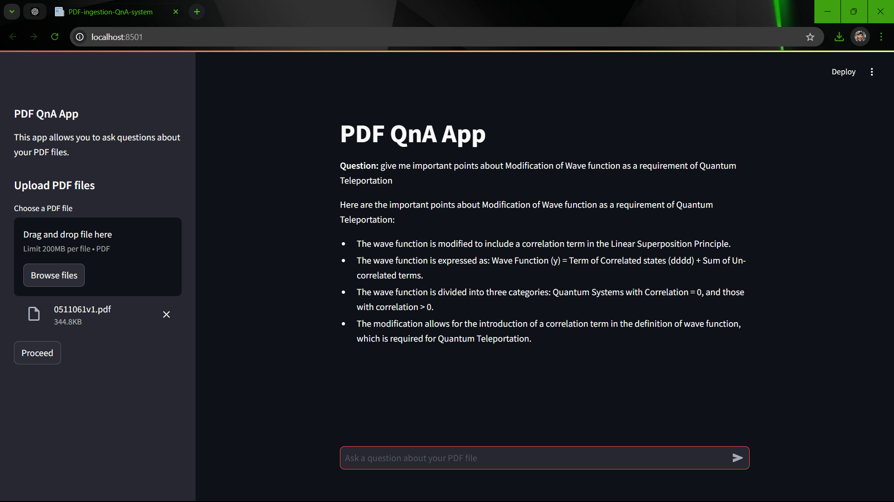

# PDF-ingestion-QnA-App


## Overview

The **PDF-ingestion-QnA-App** is a powerful application that allows users to upload PDF documents and ask questions based on the content of those documents. Leveraging advanced language models and retrieval-augmented generation techniques, this application provides concise and accurate answers from the uploaded PDFs.



## Features

- Upload and process PDF documents.
- Ask questions about the content of the uploaded PDFs.
- Efficient text splitting and embedding using state-of-the-art models.
- In-memory vector storage for fast retrieval of document chunks.
- User-friendly interface built with Streamlit.

## Technologies Used

- **Python**: The programming language used for the implementation.
- **LangChain**: A framework for developing applications with language models.
- **Streamlit**: A library for building interactive web applications.
- **Hugging Face**: For pre-trained models and embeddings.
- **Groq**: For efficient model execution.


## Installation

To get started with the PDF Q&A System, follow these steps:

1. **Clone the repository**:
   ```bash
      git clone https://github.com/vishnun0027/PDF-ingestion-QnA-App.git
      PDF-ingestion-QnA-App
   ```
2.Install the required packages:
```bash
   pip install -r requirements.txt
```
3. Set up environment variables: Create a .env file in the root directory of the project and add your API keys:
```bash
  GROQ_API_KEY=your_groq_api_key
  HF_API_KEY=your_hugging_face_api_key
```

## Usage
1. Run the Streamlit application:

2. run app
```gash
   streamlit run app.py
```


3. Upload a PDF:
Use the sidebar to upload your PDF document.

4. Ask Questions:
After processing, enter your questions in the chat input field to receive answers based on the content of the PDF.
